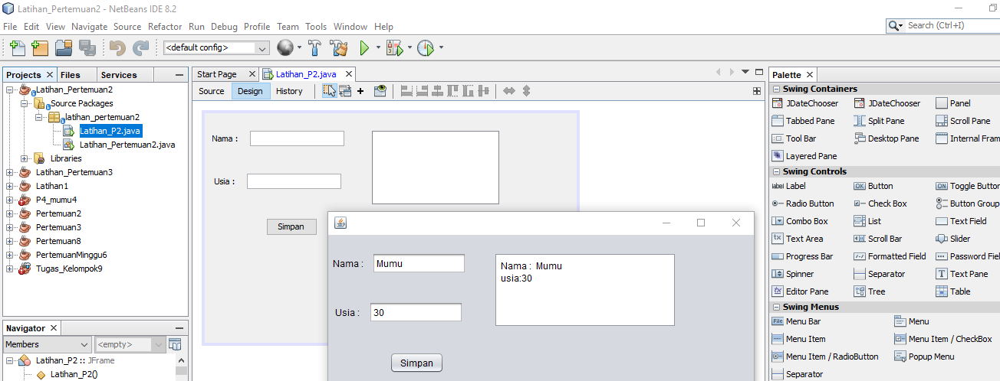
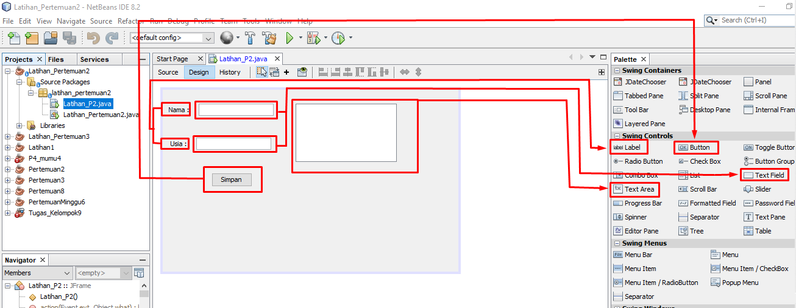
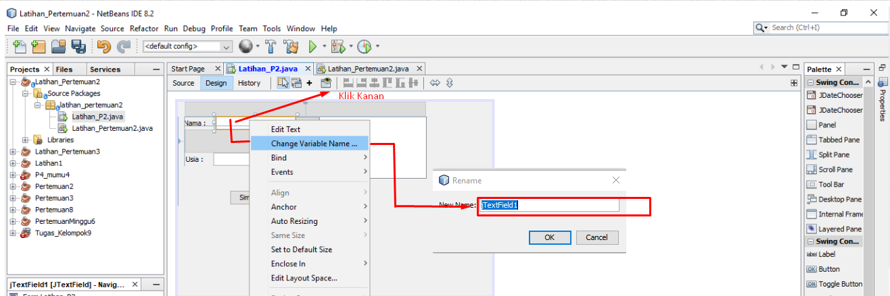
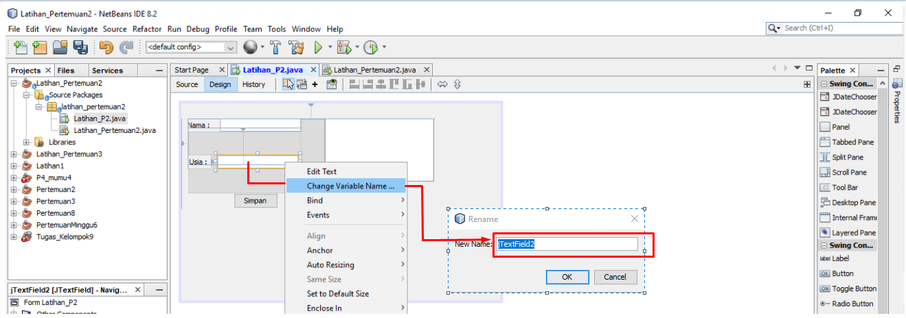
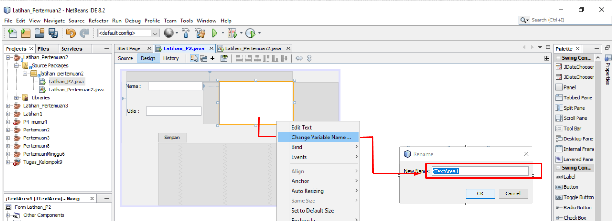
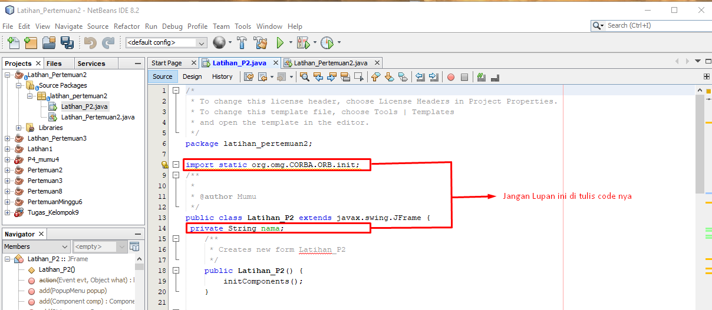
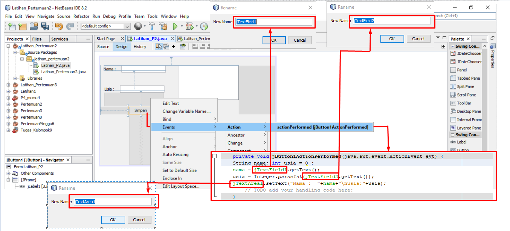

## JAVA

## 1. Membuat Aplikasi "Form Data Diri"

## 2. 

## 3. Jangan Lupa Klik Change Variable Name Tulis (jTextField1)

## 4. Jangan Lupa Klik Change Variable Name Tulis (jTextField2)

## 5. Jangan Lupa Klik Change Variable Name Tulis (jTextArea1)

## 6.  jangan Lupa di Ketik Ya Sayang

## 7. 

